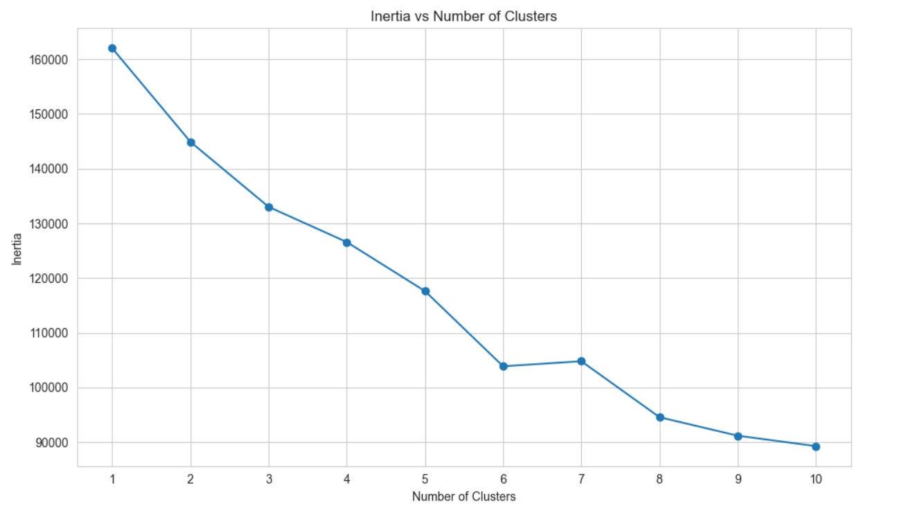

# Customer Segmentation

In this guided project, we will apply unsupervised machine learning techniques to solve a real-world business problem. We have been provided with a dataset containing information about clients from a credit card company. Our objective is to partition the company's customers into distinct groups so that tailored business strategies can be developed for each segment.

View this project live on Google Colab [here](https://colab.research.google.com/drive/1pFiQmdh96FYCsJPVDsDDZ6oJVB8FByGD?usp=sharing).
